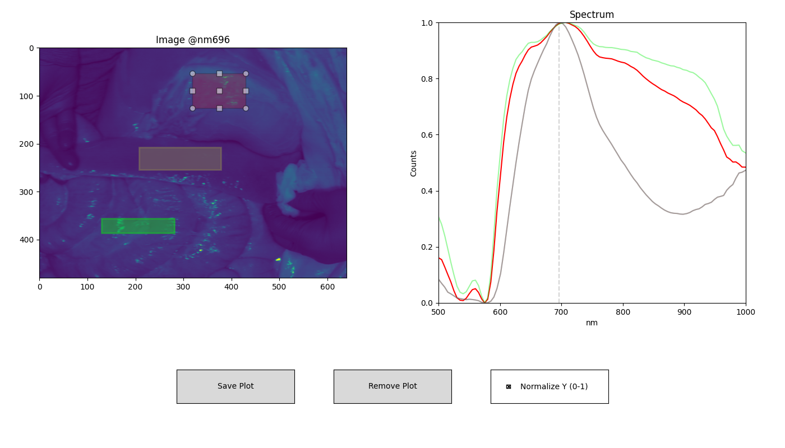

# Summary

`hsi-wizard` is an open-source Python package designed for processing, analysing, and visualising hyperspectral datasets, primarily in medical applications. Hyperspectral data refers to images where each pixel contains multiple intensity values at different wavelengths, with the number of spectral bands ranging from only a few to well over a thousand. These datasets vary in resolution and structure, making analysis difficult due to inconsistent formats and limited reproducibility. To address these challenges, `hsi-wizard` provides a standardised data representation and analysis protocols that enhance reproducibility. The package features the `DataCube`, a standardised class for representing hyperspectral data, which simplifies data manipulation compared to traditional array-based tools like NumPy. The `DataCube` includes built-in methods tailored specifically for hyperspectral data, facilitating quicker exploration and reducing complexity for users.

A notable feature of the `DataCube` class is its protocol functionality, which records the methods used from the `hsi-wizard` library. This protocol acts as a reusable template for other datasets, allowing researchers, including those without programming experience, to replicate analyses accurately and effortlessly. Additionally, `hsi-wizard` allows users to merge `DataCubes` due to its standardised representation. This capability enables researchers, for example, to easily combine near-infrared (IR) and Raman spectroscopy datasets, resulting in more comprehensive and detailed tissue analyses. Such multimodal analysis simplifies the process and provides greater insights from combined data.

Overall, `hsi-wizard` streamlines the workflow for processing, analysing, and visualising hyperspectral data. It caters to both beginners and experts. Students can utilise straightforward methods for educational purposes, while researchers can leverage advanced functions for professional studies, ensuring that results are reproducible and transparently documented.

# Statement of Need

Hyperspectral imaging (HSI) allows for an in-depth analysis of the electromagnetic spectrum across multiple wavelengths for each pixel in an image. Initially developed for NASA applications, HSI is now applied in various fields, including medicine, agriculture, environmental monitoring and more [@Bhargava]. In medical research, for example, HSI is instrumental in distinguishing healthy tissue from cancerous areas or detecting early-stage diseases.

The evolution of these fields has led to a variety of methods for acquiring hyperspectral data, encompassing different measurement techniques such as reflection, transmission, and fluorescence, as well as varying wavelength ranges (ultraviolet, visible, infrared) and scanning methods (e.g., point scanning, line scanning, Fourier transform infrared imaging (FTIR)) [@Guolan]. Consequently, datasets exhibit diverse formats, resolutions, and spectral ranges, which complicates analysis workflows and can hinder efficiency and reproducibility.

The `hsi-wizard` addresses these challenges by standardising data representation through its `DataCube` class, enabling consistent analysis across diverse hyperspectral datasets. Unlike traditional software tools like NumPy or specialised applications such as ENVI or SPy, which often require extensive programming or manual adjustments to manage variability, `hsi-wizard` streamlines data handling and integrates multimodal datasets seamlessly. It also promotes reproducibility through automated protocol logging.

Moreover, the extensibility of `hsi-wizard` allows users to incorporate new analysis methods or customise existing workflows easily, ensuring adaptability to evolving research needs. This flexibility guarantees that `hsi-wizard` remains relevant across various research scenarios, significantly reducing barriers to hyperspectral data analysis while promoting transparency and reproducibility in scientific research.

To further facilitate the analysis of diverse datasets and eliminate the need for custom methods for each, `hsi-wizard` standardises their representation through the `DataCube` class. This standardisation is crucial for enabling data fusion across different scanning processes, as scans from various scanners yield unique datasets with differing resolutions and aspect ratios. Thus, merging these scans begins with a well-defined data representation and methods to address these challenges. `hsi-wizard` provides these capabilities, simplifying the combination of datasets for subsequent analysis.

Additionally, `hsi-wizard` allows users to log and save manipulations of the `DataCube`. These logs can be reused for similar `DataCubes`, ensuring consistent analysis across different measurements. This feature diminishes the need for programming expertise and enhances reproducibility, thereby supporting the goal of increased transparency in research [@Knottnerus].

## Comparison with Existing Tools

A variety of open-source and commercial tools exist for hyperspectral imaging, but most are tailored to geospatial tasks, low-level preprocessing, or GUI-driven workflows. Libraries like PySptools and SPy focus on raster I/O and classification for remote sensing, while tools such as HyDe provide GPU-based denoising but lack biomedical integration. Commercial options like ENVI or Spectronon offer user-friendly interfaces but are often tied to hardware and limited in scripting or batch automation.

In contrast, `hsi-wizard` is designed specifically for biomedical use. It supports multimodal fusion, protocol logging, and scripting within a unified Python environment. It handles formats like ENVI, CSV, NRRD, and TDMS and integrates cleanly into programmatic workflows. Unlike GUI-centric tools, hsi-wizard enables reproducible, automated processing for diverse spectral datasets, filling a gap between algorithm libraries and rigid GUI systems.

This makes `hsi-wizard` especially suitable for clinical imaging and research, combining flexibility, transparency, and domain-specific functionality in one open-source tool.

# Example Usage

This snippet demonstrates the use of the `hsi-wizard` package for processing and visualizing hyperspectral data, using a real sample from the HeiPorSPECTRAL dataset [@Studier-Fischer2023]. The focus is on the *spleen* example (P086#2021_04_15_09_22_02). `hsi-wizard` handles the entire pipeline: from reading the raw `.dat` hyperspectral `DataCube`, managing metadata like wavelengths, to applying PCA and agglomerative spatial clustering. It enables concise and structured exploration of spectral information in biomedical imaging. The full example is visible in the documentation.

```python3
import wizard
from wizard._processing.cluster import (
    pca, spatial_agglomerative_clustering, smooth_cluster
)

# Define Custom reader
def read_spectral_cube(path) -> wizard.DataCube:
    shape = np.fromfile(path, dtype=">i", count=3)
    cube = np.fromfile(path, dtype=">f", offset=12).reshape(*shape)
    cube = np.swapaxes(np.flip(cube, axis=1), 0, 1).astype(np.float32)
    wavelengths = np.linspace(500, 1000, cube.shape[2], dtype='int')
    return wizard.DataCube(
        cube.transpose(2, 0, 1),
        wavelengths=wavelengths,
        notation='nm',
        name='HeiProSpectral',
    )

# Initialize dc and read data
dc = wizard.DataCube()
dc.set_custom_reader(read_spectral_cube)
dc.custom_read('2021_04_15_09_22_02_SpecCube.dat')

# Inspect Data
wizard.plotter(dc)
```



```python3
# Clustering
dc_pca = pca(dc, n_components=10)
agglo = spatial_agglomerative_clustering(dc_pca, n_clusters=5)
agglo = smooth_cluster(agglo, n_iter=10, sigma=0.5)
```

![Comparison between manual annotation (top-right) from [@Studier-Fischer2023] and automated segmentation (bottom-left) using spatial agglomerative clustering (k = 5) on PCA-reduced hyperspectral data. The original RGB image (top-left) and the resulting cluster map (bottom-right) provide visual context and output structure.](assets/Example_output.png)

# Future Work

The development of `hsi-wizard` is ongoing, with future goals that include expanding support for additional data formats and integrating advanced data analytics. We encourage feedback, contributions, and ideas from the community. All versions of `hsi-wizard` are available on the Python Package Index (PyPI) or on Github [@github_wizard].

# Acknowledgements

The development of hsi-wizard was funded by the CeMOS Research & Transfer Center and the Technical University of Applied Sciences Mannheim. The software was developed based on practical requirements and datasets provided by our research group: Kümmel [@kummel] shaped the mid-infrared data handling and clustering through his work on brain tissue imaging; Heintz [@heintz] provided multimodal Raman and VIS use cases; Manser [@manser] contributed workflows for Raman light sheet microscopy; Nachtmann [@nachtmann] validated complex 3D Raman pipelines; and van Marwick [@vanmarwick] influenced preprocessing through chemical segmentation tasks.

# References

